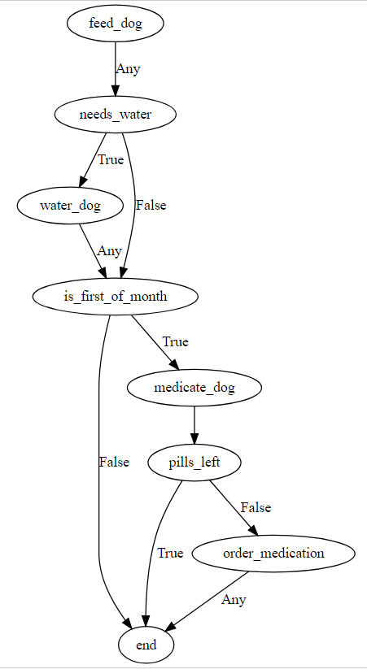

# fair_flow
A Simple Workflow Library

## Overview
fair_flow is a workflow library. With it you can describe a process and have the computer follow all the steps in that process.  It's like a programming language for non-programmers. Business users or other subject matter experts can change how it works without waiting for a developer.

The basic building block in fair_flow is the **activity**.  An activity is a reusable piece of code that completes one step.  For instance, an activity might get data from a service, calculate a value, or send an email.  An activity can be strung together with other activities to describe a process. Activities can be used more than once in the same process or in different processes.

A **process** is a group of activities.  The process describes what activities will be executed and how they relate.  Think of a process as a recipe.

To run a process, you first create a **job**. A job is a copy of the process that _remembers which values have been set and steps have been done_.
If a process is a recipe for a sandwich, a job is a copy of the recipe PLUS what happened when you did each step.  If someone ordered 2 sandwiches at the same time, we'd want to make sure we did all the steps for each sandwich.  Jobs keep up with which activities have run, and which ones still need to run.

Processes are started by a **trigger**.  A trigger is like when someone orders a sandwich.  Triggers can be if an alarm gets raised, an email comes in, or if a timer expires.  

A trigger matches a process, which creates a job with all the activities.  There's more to it, but let's see how it works together.

# Example

For an example, lets say we have a smart home, and we wanted a process that would automate the morning dog chores.  The steps might be.

1.    Feed the dog.
2.    Give it water if it needs it.
3.    If it's the first of the month, give it a pill.  If its the last pill, order more.

If you break this into individual activities, it might look like this:
1.    Feed the dog.
2.    Does it need water?

        2.1    Yes: give it water.

        2.2    No: do nothing.

3.    Is it the first of the month?

        3.1      No: do nothing.

        3.2      Yes:  Give it a pill

        3.3      Any pills left?

                3.3.1 . Yes: do nothing.

                3.3.2 . No:  order pills.

4.    Finish

The trigger for this example would be a timer, which would go off every morning.  That trigger could include information we need to complete the job like what day of the month it is.

### Step 1:  Programmatically
Programmatically, you can see there are two types of tasks: custom and standard.  Our custom commands interact with the smart home: feed dog,
water dog, medicate dog, order medication.

Custom steps are written in Python, and extend the Activity class.  This gives them a method called 'execute' where the custom code can go.  It's also the key to testing activities with different inputs and outputs before they go into production.

Custom commands look like this:

[This code in in example/fair_bpm_example.py]

<pre>
import fair_bpm

class FeedDog(fair_bpm.Activity):
    def execute(self, context=None):
        print("Starting feed dog")
        # Put feed dog code here

class WaterDog(fair_bpm.Activity):
    def execute(self, context=None):
        print("Starting water dog")
        # Put water dog code here

class MedicateDog(fair_bpm.Activity):
    def execute(self, context=None):
        print("Starting medicate dog")
        # Put medicate dog code here
        # Set Pills Left in context

class OrderMedication(fair_bpm.Activity):
    def execute(self, context=None):
        print("Starting order_medication dog")
        # Put order_medication dog code here
</pre>

For the other tasks, we can use the built-in activities. Making simple decisions, comparing strings, and string manipulation can be handled by the Command activity.  This activity runs a snippet of custom python code that you describe in your process.  **Note:**  Running custom code that your users type in is a bigger topic that we won't get into here.

### Graphically
This flow would graphically look like this

### Conceptually
We start at the top and see the first activity is to feed the dog.  Then the arrow goes to "need_water" activity, where your code would interact with the smart home to find the water level in the dog's bowl.  There are two arrows that come from that, labeled True and False.  If the needs_water activity decides that dog does need water, it follows the True path and add some water to her bowl.  If not, it skips that step and goes on.

Each activity can have a "returned" vale that can be either True, False, or Any. For an activity, The job will only follow the True or False path if the returned value matches for that activity.  If the label leading from that activity is Any, then the job will always execute that step regardless of the returned value.

Behind the scenes, chores are saved in DOT file format like this.
<pre>
digraph chores
{
    feed_dog [name="fair_flow_example.FeedDog"]
    needs_water [name="fair_flow_example.CheckWater"]
    water_dog [name="fair_flow_example.WaterDog"]
    is_first_of_month [name=Command command="me.returned=True"]
    end [name=Say]
    medicate_dog [name="fair_flow_example.MedicateDog"]
    pills_left [name=Command command="me.returned=False"]
    order_medication [name="fair_flow_example.OrderMedication"]

    feed_dog -> needs_water [label=Any]
    needs_water -> water_dog [label=True]
    needs_water -> is_first_of_month [label=False]
    water_dog -> is_first_of_month [label=Any]
    is_first_of_month -> end [label=False]
    is_first_of_month -> medicate_dog [label=True]
    medicate_dog -> pills_left
    pills_left -> end [label=True]
    pills_left -> order_medication [label=False]
    order_medication -> end [label=Any]
}
</pre>

You can see we start with a
<pre>
  digraph chores
</pre>
 which in DOT language means "directed graph", or nodes that are connected by arrows.  Then in {} we have two types of objects: a set of nodes and a set of edges.  The nodes look like
<pre>
  node_name [ key=value ]
</pre>

The keys and values depend on the python class for that activity, but each node gets at least a class name.  The first two nodes are feed_dog and need_water.

The next session is a list of edges between the nodes like this:
<pre>
  feed_dog -> needs_water [label=Any]
</pre>

Here the idea is the same as nodes, but the only key is 'label' and the value is the condition that we require from the activity's returned value.

# Features:

*  Modular design
*  Conditional logic
*  Graphical Components
*  Easy to save and analyze

# Behind the scenes
FairBPM communicates jobs and processes in a language known as [DOT](https://www.graphviz.org/).  DOT describes activities as nodes, and decisions as lines.  This way, we can easily describe what needs to be done.

If you'll look at the chores example above, you can see there are a set of nodes (feed_dog, needs_water,...), a blank line, and then a list of relationships between the nodes.  This is how DOT files work.  You can add all the extra key/value pairs you need, and it's still valid DOT format, whether DOT uses that pair or not.  This flexibility lets us use it for our processes.

For each activity there are a list of key/value pairs [inside brackets] that give you the name of the activity.  These correspond to the class names that get run for every activity.

If you'll look at the is_first_of_month node, the name is Command, and it has a "command" key with a value of "me.returned=True".  This string is actually __python__ code that gets run for this activity.  This is dangerous in the hands of hackers so you'll need to be careful.

# What's Missing?
The big thing that users need (but the library doesn't) is a Graphical User Interface.  This is a graphical language, and it needs a reliable interface for the users to use.  Otherwise, they'll be POSTing strings to services, and we can do better than that.

Luckily, Graphviz has been around for decades, so there are parsers for it in just about any language you'd want to use.

In order to be a helpful tool for non-programmers, we'll need a snazzy front end that makes it easy to:
*  Declare nodes and Edges (and their attributes)
*  Use the RESTful interface to CRUD processes

# Installation

First, clone this repo.  You'll also need the excellent dot_tools dot parser

pip install git+https://github.com/timtadh/dot_tools.git

# Getting Started
There is a demo available in the FairBPM directory with the command

  python demo.py

This will open up the demo.dot file, print it, create a job, run it through a job runner, and print out the results.

 Each node in this process randomly returns True or False.  Each time you run it, you'll see it runs a random path from beginning to end.

If you copy the text from the word 'digraph' to the closing curly bracket, then paste it into the text area on the left at http://viz-js.com/, you'll see what the run of this job looks like.  Run it again and see that it does something different.
